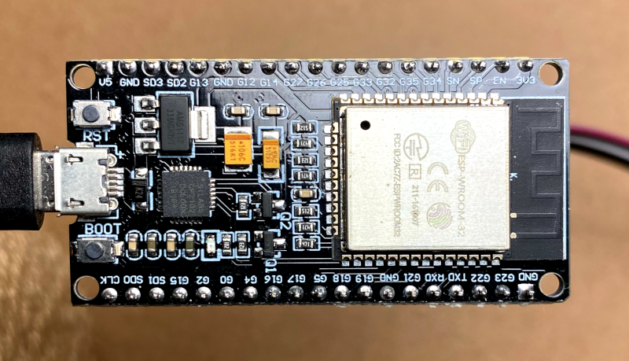
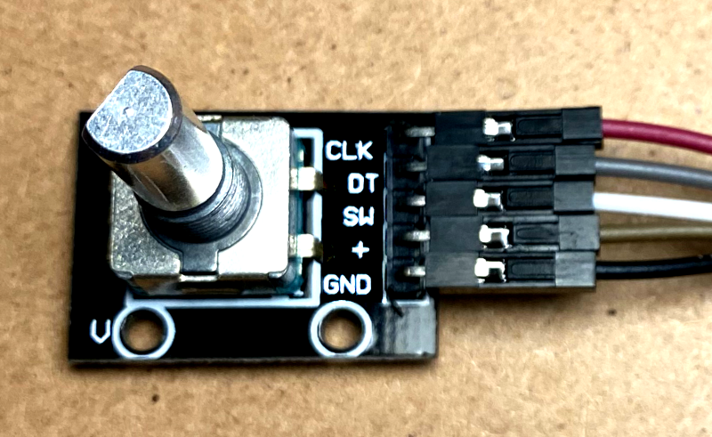

# Rotary - Web Serial API

This project demonstrates the use of Web Serial API with an ESP32 Wroom board connected to a rotary encoder. \
The ESP32 is programmed to send byte data over the serial interface when the rotary encoder is rotated. \
The board is connected to a PC via USB, enabling communication between the ESP32 and the browser. \
Through the browser, users can read the transmitted bytes and interact with a web interface. This interactive web interface allows users to control and respond to the data sent by the ESP32. \
The integration of Web Serial API facilitates a seamless connection between the microcontroller and the browser, providing a practical demonstration of utilizing this web technology for real-time communication with embedded systems.

## Hardware Components

- ESP32 Wroom Board

- Rotary Encoder

- Jumper Wire Cable (F2F)
- Micro USB Cable (Power and Data)
- PC or Mac
- Google Chrome

## Wiring diagram
| Rotary encoder  | ESP32   |
| --------------- | ------- |
| CLK             | GPIO25  |
| DT              | GPIO26  |
| SW              | GPIO27  |
| +               | 3V3     |
| GND             | GND     |

## Board development

To run the Web Serial API demo on the ESP32 Wroom board, follow these steps to upload the firmware:

1. __Open Arduino IDE:__ ensure that you have the Arduino IDE installed on your computer. If not, download and install it from the [official Arduino website](https://www.arduino.cc/en/software).

2. __Configure Arduino IDE for ESP32:__ make sure that your Arduino IDE is properly configured to work with the ESP32 board.

3. __Open the Arduino Sketch:__ navigate to the "board" folder in this project's repository and open the "rotary-enc.ino" file in Arduino IDE.

4. __Select ESP32 Board:__ in Arduino IDE, go to "Tools" > "Board" and choose the appropriate ESP32 board from the list.

5. __Set Port and Upload:__ connect the ESP32 board to your computer using the micro USB cable. Go to "Tools" > "Port" and select the port to which your ESP32 is connected. Finally, click on the "Upload" button to compile and upload the sketch to the ESP32 board.


Once the upload process is complete, the ESP32 Wroom board will be ready to interface with the rotary encoder and transmit data over the serial connection. Ensure that the hardware connections are correctly set up as specified in the earlier section, and then proceed to interact with the demo through the Google Chrome browser as described in the main documentation.

## Web development

To launch the React web interface and interact with the ESP32 through the browser, follow these steps:

1. __Navigate to the "web" Folder:__ open a terminal and change the directory to the "web" folder in this project's repository.

2. __Install Dependencies:__ Run the following command to install the necessary dependencies:
```bash
npm install
```

3. __Start the React App:__ after the installation is complete, launch the React app with the following command:
```bash
npm run start
```
This will start the development server, and you should see output indicating that the app is running.

4. __Access the Web Interface:__ open your Google Chrome browser and navigate to http://localhost:3000 or the address specified in the terminal.

5. __Connect to the ESP32:__ on the web interface, click the "Connect controller" button to establish a connection with the ESP32.

6. __Select Serial Port:__ use the interface to select the serial port to which the ESP32 is connected.

7. __Navigate Menus with Rotary Encoder:__ rotate the rotary encoder to move between menu options on the web interface.

8. __Enter Menu Item:__ press the rotary encoder to enter a selected menu item.


With these steps, you'll have the React web interface running, connected to the ESP32, and ready to respond to the rotary encoder's input. Explore the functionality of the demo by navigating menus and experiencing real-time updates as you rotate and press the rotary encoder. This integration showcases the seamless communication between the web interface and the ESP32 facilitated by the Web Serial API.